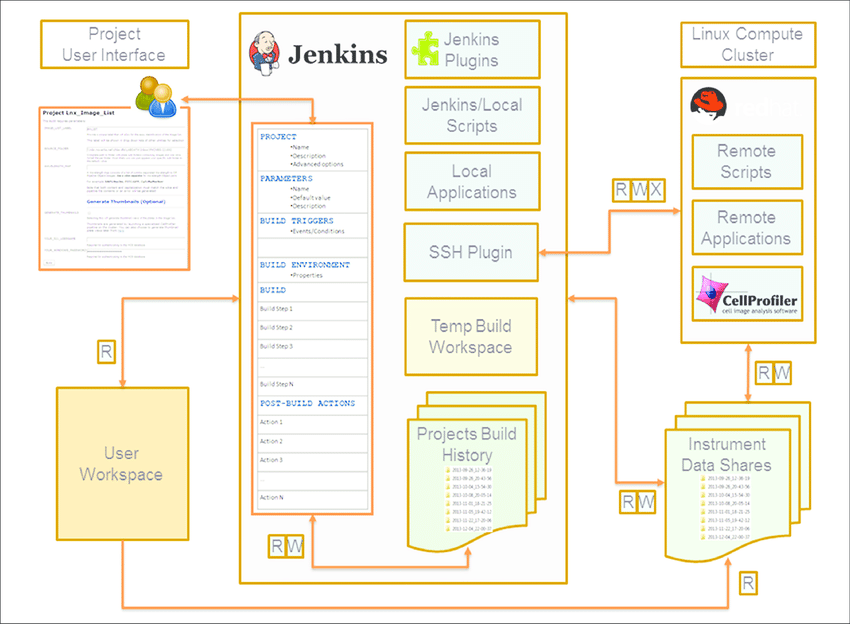

# What is Docker

 

[Source](https://docs.docker.com/storage/volumes/)

---
Docker Volumes and Bind mounts 
---
 

[Source](https://jfrog.com/knowledge-base/a-beginners-guide-to-understanding-and-building-docker-images/)

---

# What is Jenkins
- Master and Slave nodes
  - Underlying system
  - Docker
- Executors
  - \# of parallel executors
- Projects
  - Build Triggers
  - Build Scripts (Jenkinsfiles)
  - Workspace
- User management and authentication
 

[Source](https://www.researchgate.net/profile/Ioannis-Moutsatsos/publication/311153114/figure/fig1/AS:443682252955648@1482793500527/Architecture-of-Jenkins-CI-configured-as-a-scientific-data-processing-platform-A-typical.png)

---
