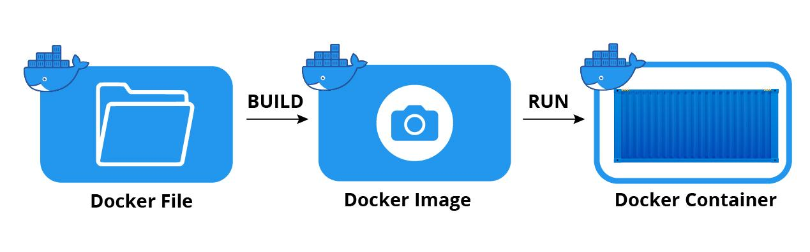

# What is Docker
Dockerfiles -> 
Docker Images -> 
Docker Container 

<br>

<br>

[Salsa](https://docs.docker.com/storage/volumes/)

Docker Volumes and Bind mounts 

---
<br>

<br>

---

[Salsa](https://jfrog.com/knowledge-base/a-beginners-guide-to-understanding-and-building-docker-images/)

# Workspace Cleanup
## Containers 
-  You can take a look at all running containers using ```docker ps``` 
-  You can stop a running container that you no longer want to use by running ```docker stop <CONTAINER_ID>```
  - You can also use the container `NAMES` instead of the ```<CONTAINER_ID>``` to specify which container to stop
  - If ```docker stop <CONTAINER_ID>``` does not work try using the ```docker kill <CONTAINER_ID>``` command, see [differences](https://www.baeldung.com/ops/docker-stop-vs-kill) 
-  You can take a look at all (running and stopped) containers with ```docker ps -a``` 
-  To clean up all stopped containers from using disk space on your machine use ```docker container prune```, [for further options](https://docs.docker.com/engine/reference/commandline/container_prune/)
## Images
-  You can list all docker images currently on your machine by running ```docker image ls```
-  You can remove a particular image by running ```docker image rm <REPOSITORY:TAG>```
-  You can remove [dangling images](https://docs.docker.com/config/pruning/) by running ```docker image prune```
-  You can remove ALL images by running ```docker image prune -a```
## Volumes
-  If you want to remove the Jenkins data and configuration you can run ```docker volume rm <volume_name>``
-  If you want to remove all docker volumes run ```docker volume prune -a```