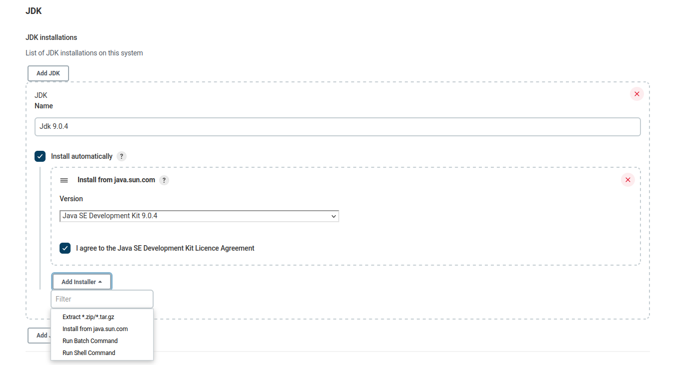

#  SCM 
- Configure checkout and Pipeline script from SCM
[](https://www.youtube.com/watch?v=CmwTPxdx24Y&t=401s)
- SCM Polling 
  -  Polls every five minutes  
      ```
      H/5 * * * *
      ```
# Building with a particular mvn and java version 
- Go to http://jenkins_url/configureTools/ and search for JDK installation 
  Select your jdk version to be automatically installed, or pick a custom installation method
<br>

<br>


- The same thing can be done for maven 
<br>

<br>
- The Jenkisfile using the JDK and maven version specified in the above steps looks like the following

```
pipeline {
  agent any
  tools {
  maven "Maven 3.8.6"
  jdk "Jdk 9.0.4"
  }
  stages {
      stage("Test version") {
          steps {
              sh 'mvn -v' 
          }
      }
  }
}
```
`Note that the names defined in the first steps are the same with the names in the quotes `

# Post-Build Actions
- Commands that can be run always, only when the pipeline succeeds, or when it fails.

```
pipeline {
  agent any
  tools {
  maven "Maven 3.8.6"
  jdk "Jdk 9.0.4"
  }
  stages {
      stage("Test version") {
          steps {
              sh 'mvn -v' 
          }
      }
  }
  post {
    failure {
      echo 'I will print only on failure'
    }
    success {
      echo 'I will print only on success'
    }
    always {
      echo ‘I will always execute this’
    }
  }
}
```
# Workspace Cleanup
## Containers 
- [ ] You can take a look at all running containers using ```docker ps``` 
- [ ] You can stop a running container that you no longer want to use by running ```docker stop <CONTAINER_ID>```
  - You can also use the container `NAMES` instead of the ```<CONTAINER_ID>``` to specify which container to stop
  - If ```docker stop <CONTAINER_ID>``` does not work try using the ```docker kill <CONTAINER_ID>``` command, see [differences](https://www.baeldung.com/ops/docker-stop-vs-kill) 
- [ ] You can take a look at all (running and stopped) containers with ```docker ps -a``` 
- [ ] To clean up all stopped containers from using disk space on your machine use ```docker container prune```, [for further options](https://docs.docker.com/engine/reference/commandline/container_prune/)
## Images
- [ ] You can list all docker images currently on your machine by running ```docker image ls```
- [ ] You can remove a particular image by running ```docker image rm <REPOSITORY:TAG>```
- [ ] You can remove [dangling images](https://docs.docker.com/config/pruning/) by running ```docker image prune```
- [ ] You can remove ALL images by running ```docker image prune -a```
## Volumes
- [ ] If you want to remove the Jenkins data and configuration you can run ```docker volume rm <volume_name>``
- [ ] If you want to remove all docker volumes run ```docker volume prune -a```
